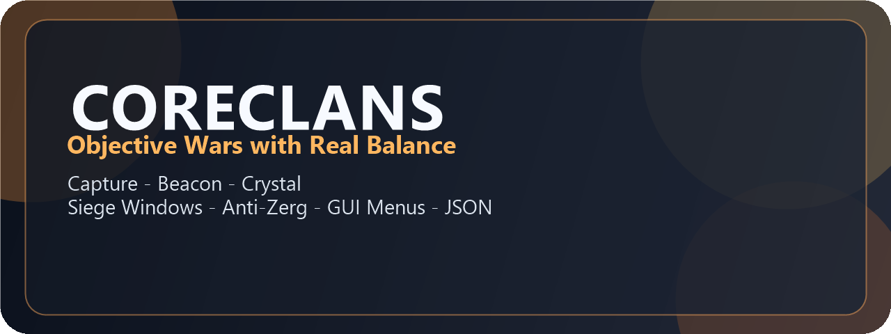
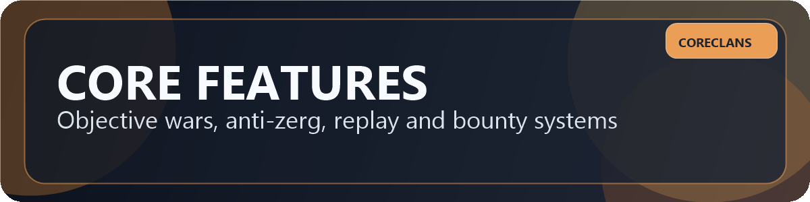
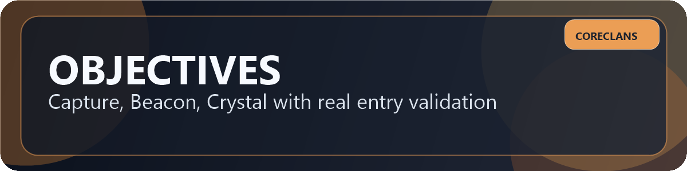
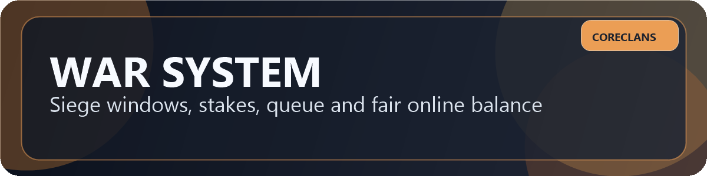
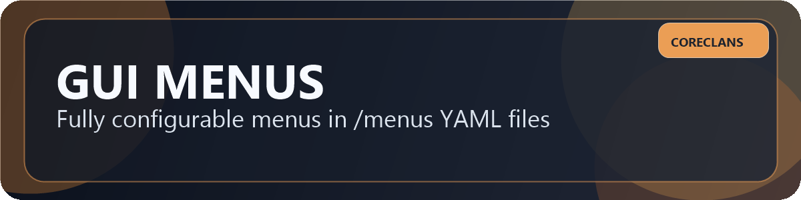
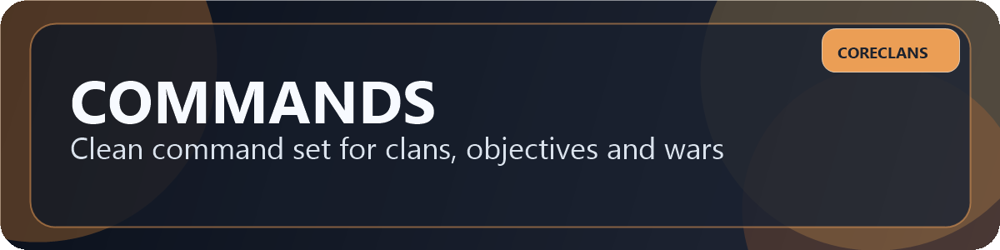
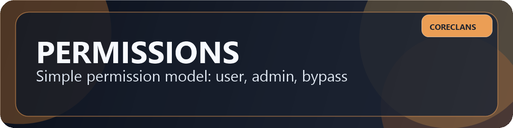
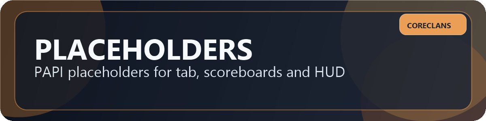
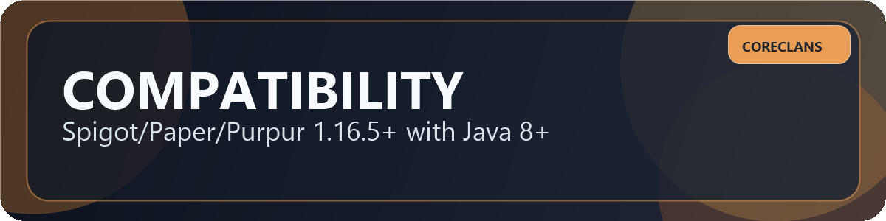

# CoreClans




CoreClans is a war-focused clan plugin designed for fair competitive gameplay.

It combines classic clan features with objective wars, siege time windows, anti-zerg balancing, war replay stats, season divisions, and a fully editable GUI menu system.

## Why CoreClans
- Objective-based wars: `capture`, `beacon`, `crystal`
- Scheduled raiding via siege windows (no forced 24/7 raids)
- Anti-zerg mechanics for online imbalance
- Attacker queue + attacker cap near objective
- Objective validation with reachability/path checks
- Local JSON data storage (no database setup)
- Ready GUI panels via `/menus/*.yml`
- PlaceholderAPI support for tab/scoreboard/HUD


## Quick Start
1. Put `coreclans-1.0.0.jar` into `plugins/`.
2. Restart server (or start server once) to generate config files.
3. Optional: install `Vault` + economy plugin for wallet-based bank operations.
4. Optional: install `PlaceholderAPI` for `%coreclans_*%` placeholders.
5. In game:
   - `/clan create <name>`
   - `/clan claim set 64`
   - `/clan objective set capture` (and/or beacon/crystal)
   - `/clan siege window set friday 18:00 22:00`
   - `/clan menu`

## Compatibility
- Minecraft: `1.16.5+`
- Cores: `Spigot`, `Paper`, `Purpur`
- Java runtime: `8+` (Java 17/21 supported)
- API target: Spigot `1.16.5-R0.1-SNAPSHOT`

## Docs
- [Installation](docs/INSTALL.md)
- [Commands](docs/COMMANDS.md)
- [Permissions](docs/PERMISSIONS.md)
- [Placeholders](docs/PLACEHOLDERS.md)
- [Configuration](docs/CONFIG.md)
- [GUI Menus](docs/MENUS.md)
- [FAQ](docs/FAQ.md)
- [Update Post Template](docs/UPDATE_TEMPLATE.md)

## Visuals









## Download Links
- Spigot: https://www.spigotmc.org/resources/%E2%9A%94%EF%B8%8Fcoreclans-%E2%9C%A8objective-wars-siege-windows-gui-json-1-16-5.133268/
- Modrinth: https://modrinth.com/plugin/coreclans

## Build From Source
```bash
mvn clean package
```

Built jar:
- `target/coreclans-1.0.0.jar`

## Storage
- Primary data file: `plugins/CoreClans/coreclans-data.json`
- Menus directory: `plugins/CoreClans/menus/`

## Support
- Bug report: [open issue](issues/new?template=bug_report.md)
- Feature request: [open issue](issues/new?template=feature_request.md)

If you find bugs or have suggestions, open an issue with your server version, CoreClans version, and reproduction steps.

## Author
- `IIevietskyi`


